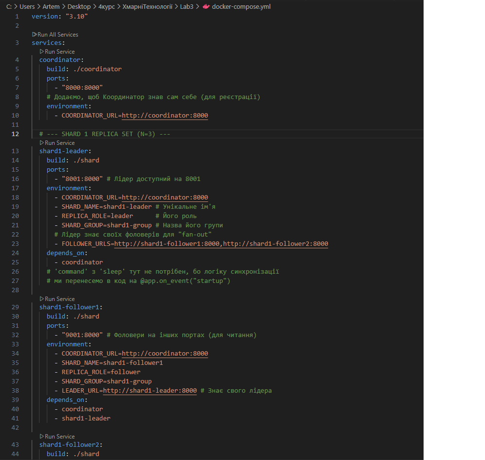

# 1. Implement replica set per each shard. 

## Оновлення інфраструктури, на цьому етапі ми змінюємо файл docker-compose.yml

## Замість shard1 тепер є shard1-leader, shard1-follower1, shard1-follower2.
## Аналогічно для shard2.
## Додано нові environment (змінні середовища), щоб кожен сервіс "розумів" свою роль (REPLICA_ROLE, SHARD_GROUP, LEADER_URL, FOLLOWER_URLS).