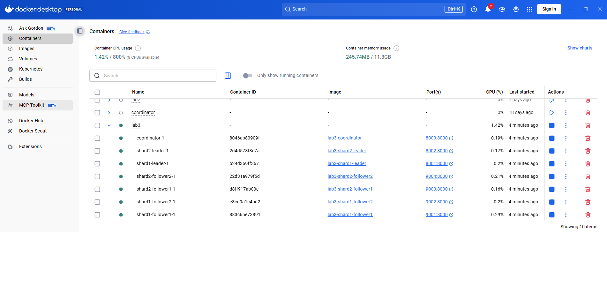
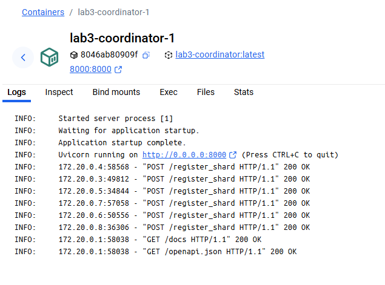
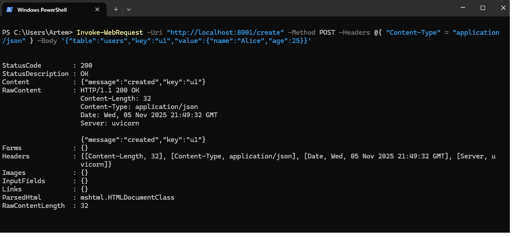
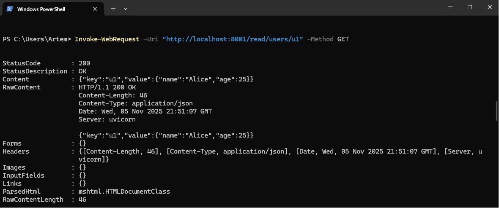
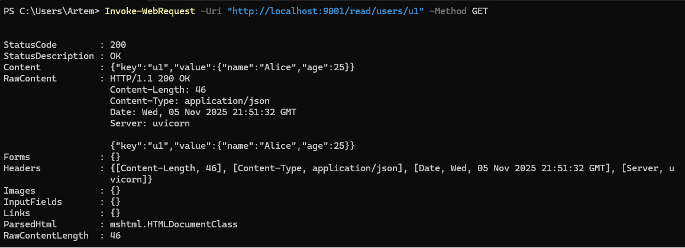
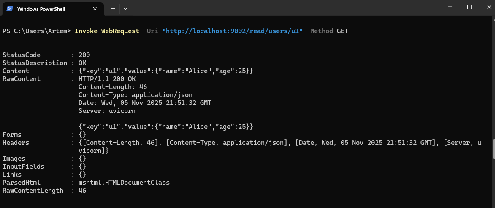
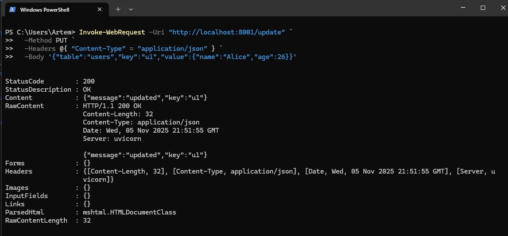
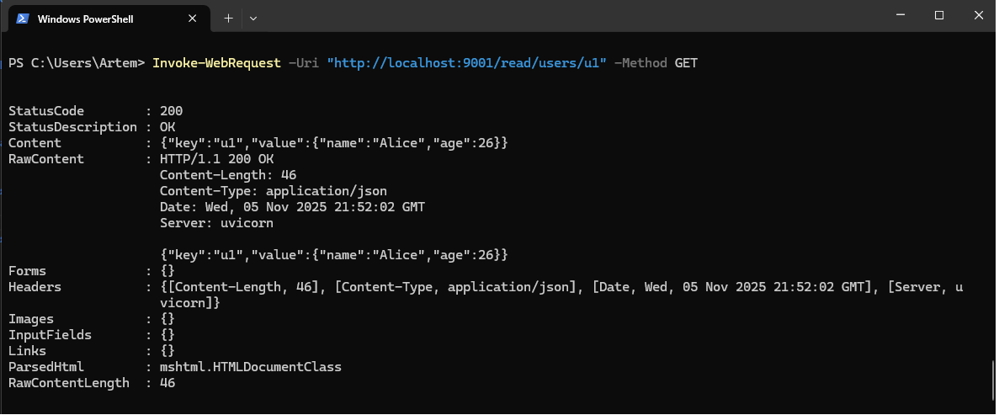
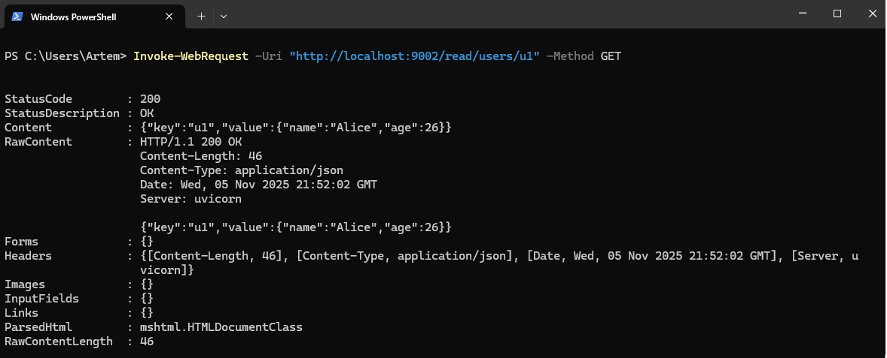
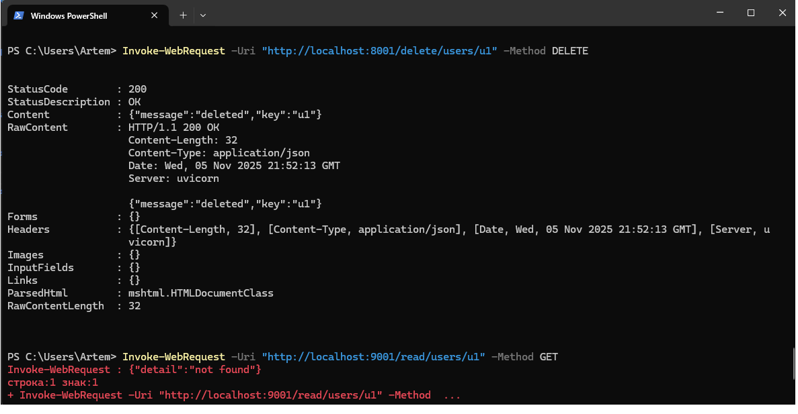

# 2. Leader  node receives writes and event-sources (fan-out) them with some log structure (Kafka, RabbitMQ, physical file on s3, etc). * think about delivery order and versions.

## Вносимо зміни до файлів shard\main.py, coordinator\main.py
## Запускаємо контейнери

## Перевіряємо регістрацію реплік на координаторі. 

## Перевіряємо роботу координатора, лідерів та фоловерів. 
## Створюємо користувача. 

## Користувач з'явився на лідері.

## Користувач з'явився на фоловері.

## Update користувача

## Оновлений користувач з'явився на фоловері.

## Оновлений користувач з'явився на фоловері.

## Видаляємо користувача та перевіряємо.

