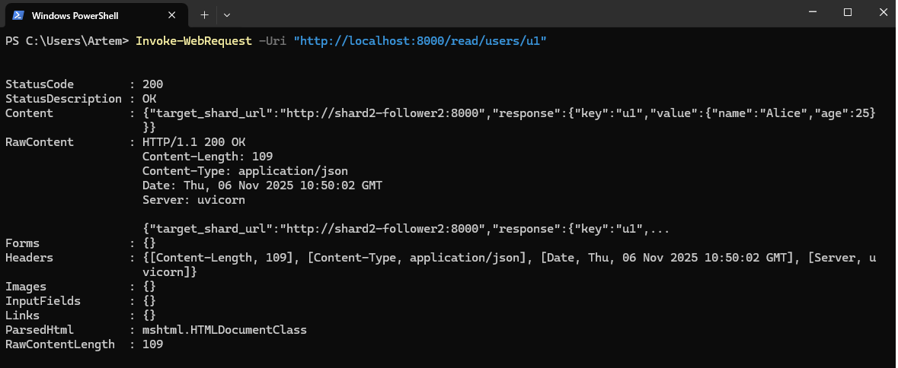
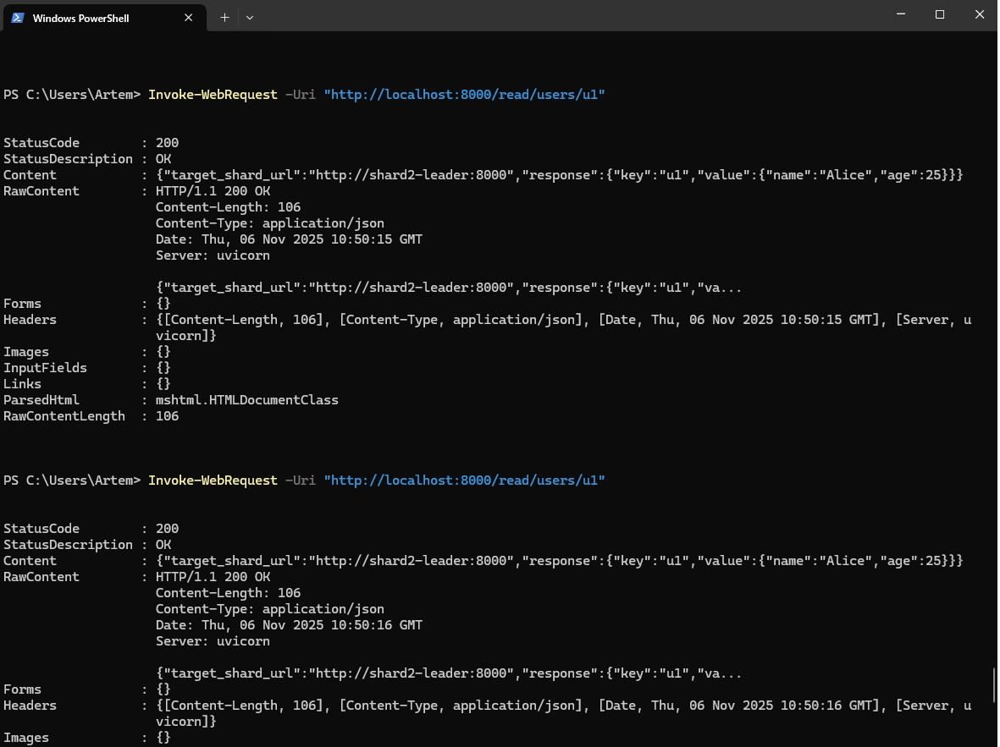
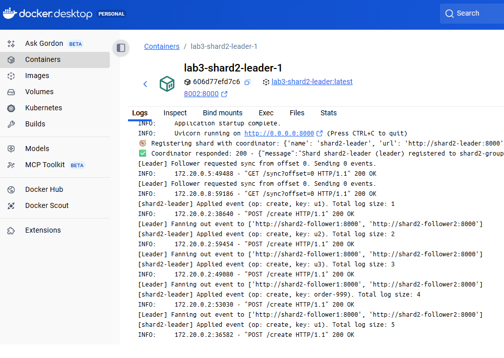
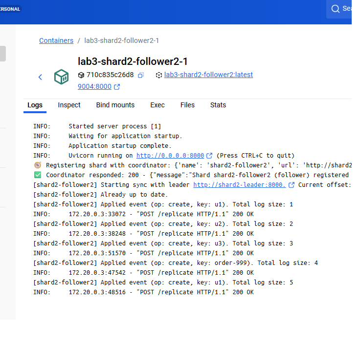
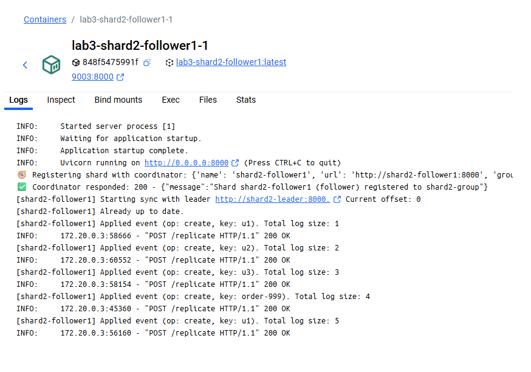
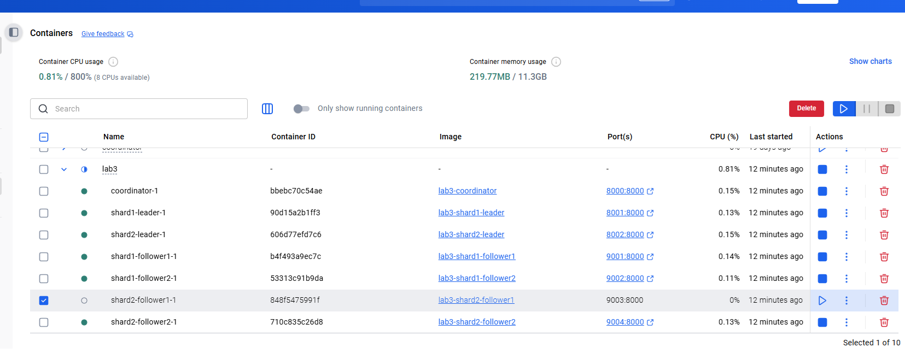
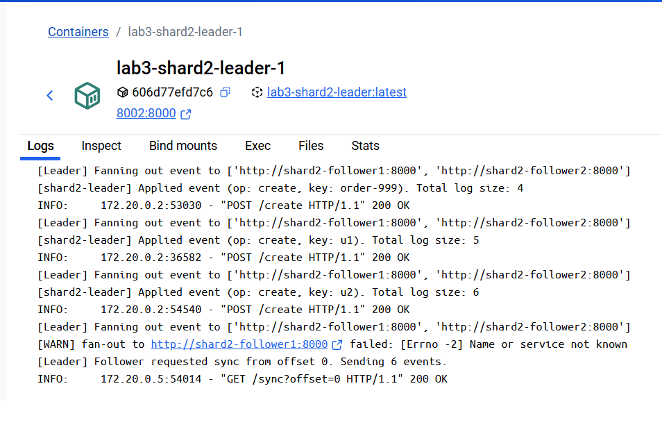
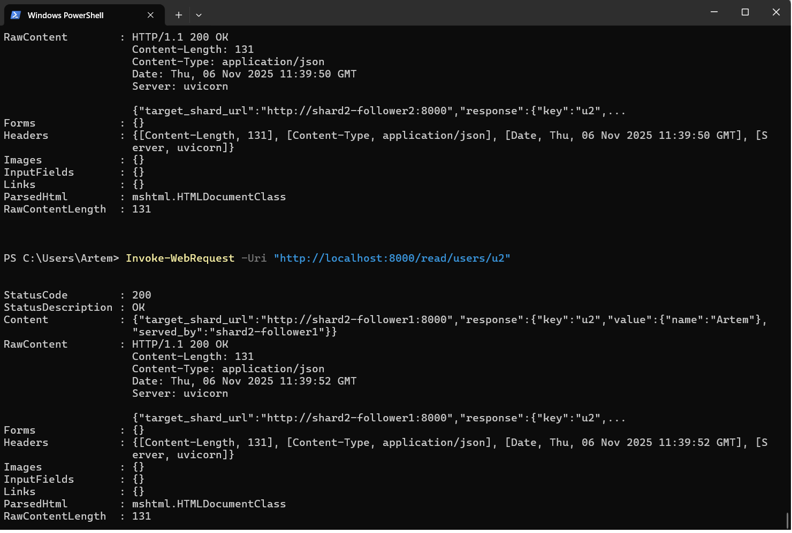

# 3. Read replicas (followers) consume log. 
# a. Note that they should be used not only for durability, but also for load distribution - read load should be evenly balanced. So controller should resolve reads to all 3+ active shards.

## Балансування читання
## Запускаємо контейнери

## Приклади балансування. 

# b. Followers should track offset and upon restart resync only relevant log range

## Відстеження "offset" та "resync" 
## Синхронізовані Шард 2 лідер 1. 

## Синхронізовані Шард 2 фоловер 2.

## Синхронізовані Шард 2 фоловер 1.

## Зупиняємо шард 2 фоловер 1.

## Ми внесли зміни до шарду 2 з вимкненим фоловером 1.

## Демонстрація синхронізації фоловера 1 з шардом після його вмикання.

