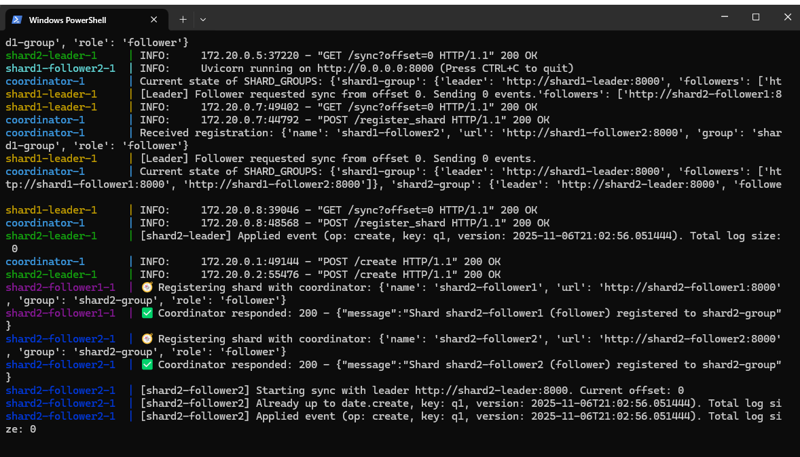
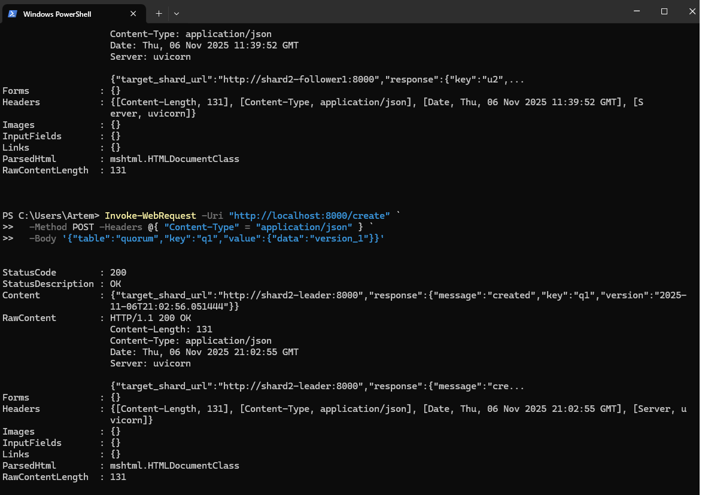
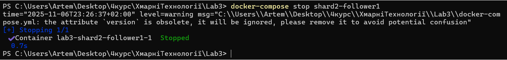
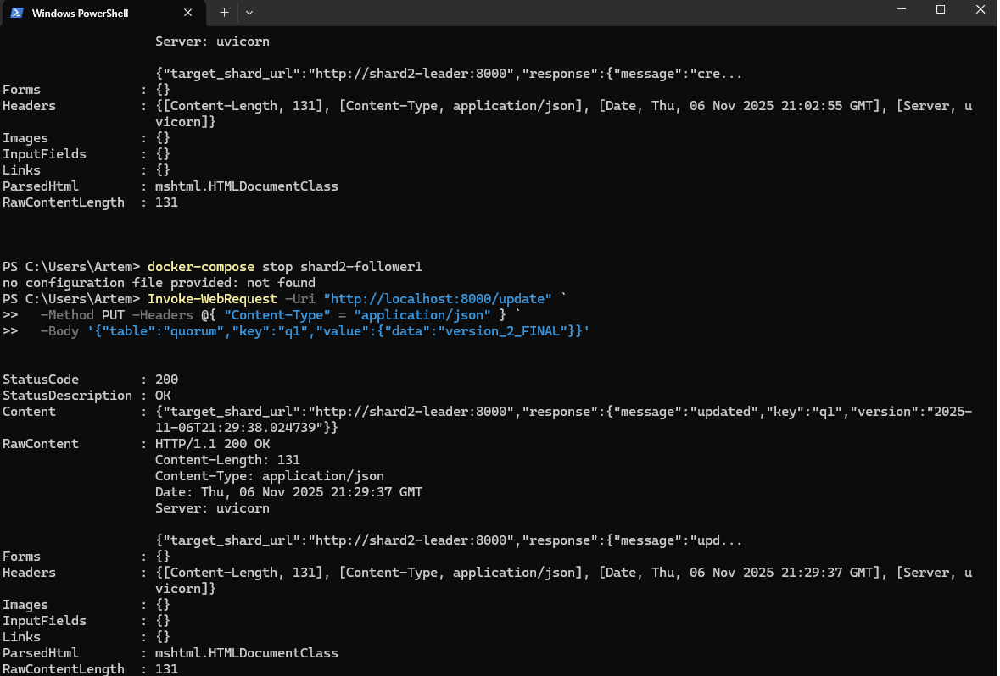
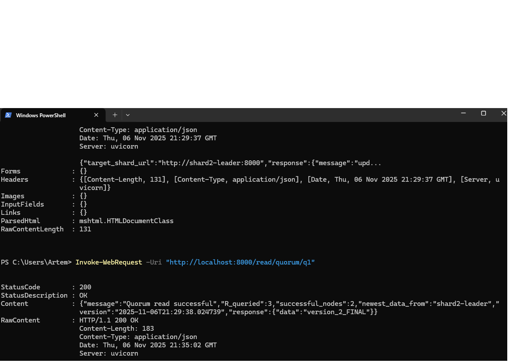
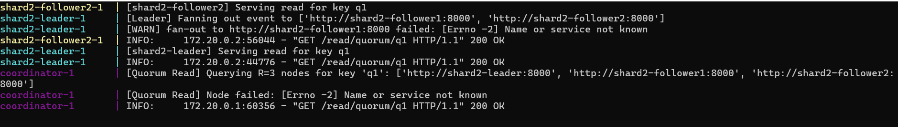

# 4. (Optional) For reads implement quorum with R+W>N rule with W=1 (for single-leader, >1 for leaderless), where N - total replicas for a key (replication factor). W - number of replicas that must durably ack a write before it “commits”. R - number of replicas a read queries; the coordinator returns the newest version among them.

## Запускаємо контейнери (docker-compose up --build)

## Створення нового ключа. 

## Вимикаємо репліку Шард 2 фоловер 1.

## Оновив ключ поки репліка вимкнена (фоловер 1).

# Тест! Читання Quorum.
## Запит на читання q1 до координатора. Видно тільки 2 шарди.

## Координатор отримав 2 успішні відповіді (обидві з version_2) і 1 помилку. Він порівняв ті, що отримав, побачив, що найновіша — це version_2.

## Система повертає найновіші дані, навіть якщо одна репліка (або навіть дві!) відстане чи вийде з ладу.
