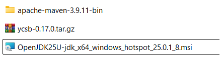
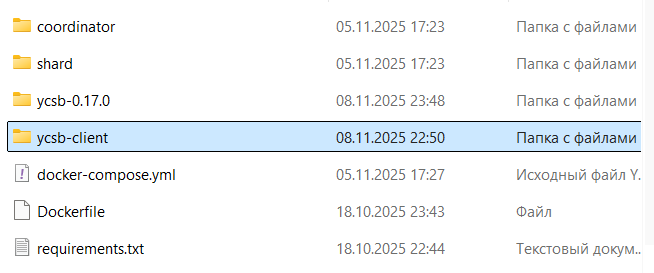
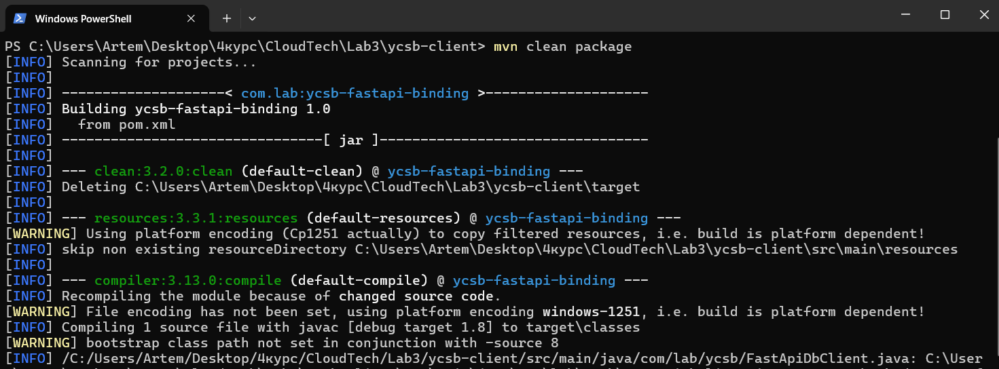
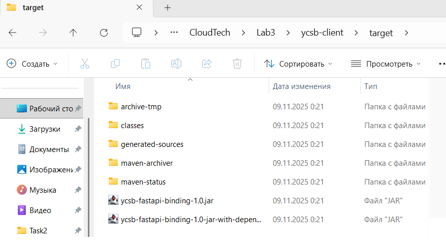
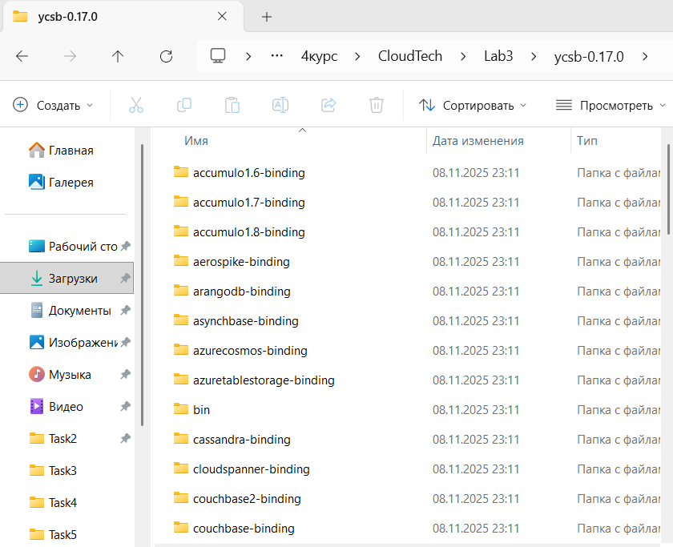
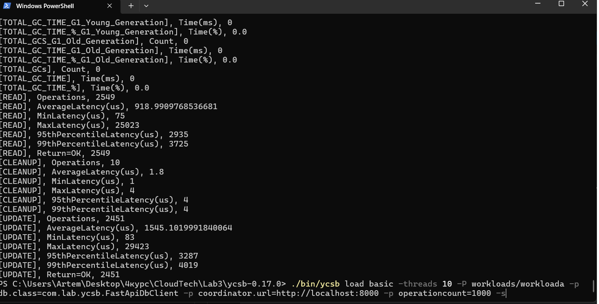
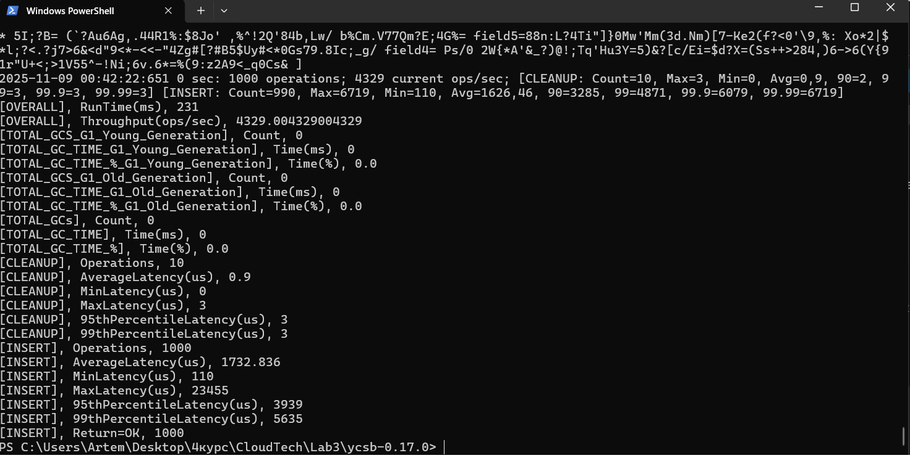
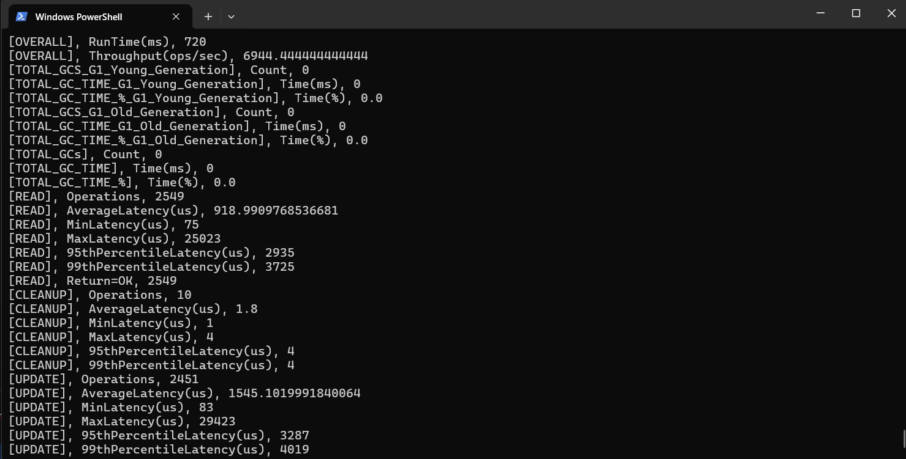

# 5. Benchmark your solution with YCSB https://github.com/brianfrankcooper/YCSB/wiki/Adding-a-Database https://benchant.com/blog/ycsb-custom-workloads

## Скачали і всстановили Java + Maven

## Налаштування Java-проекту (Maven) 

## Збірка "з'єднувача" (Binding)

## Створений клієнт

## Завантаження та Налаштування YCSB

# Запуск Бенчмарку

## YCSB-тест проходить у 2 фази:
## LOAD (Завантаження даних)
## ./bin/ycsb load basic -threads 10 -P workloads/workloada -p db.class=com.lab.ycsb.FastApiDbClient -p coordinator.url=http://localhost:8000 -p operationcount=1000 -s

## RUN (Виконання тесту)
## ./bin/ycsb run basic -threads 10 -P workloads/workloada -p db.class=com.lab.ycsb.FastApiDbClient -p coordinator.url=http://localhost:8000 -p operationcount=5000 -s

