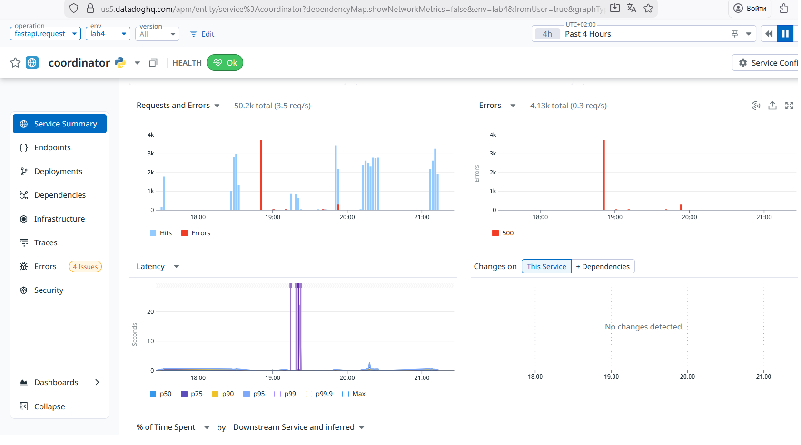
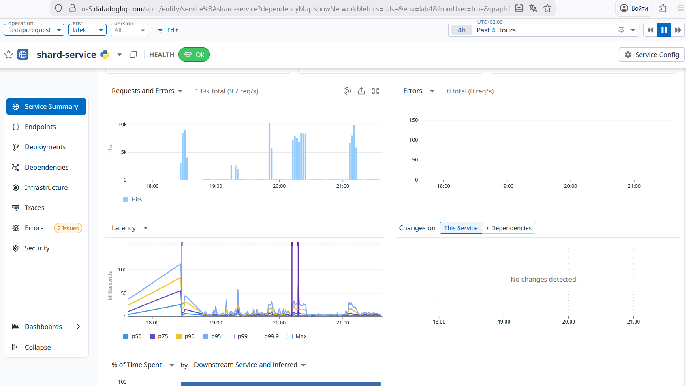
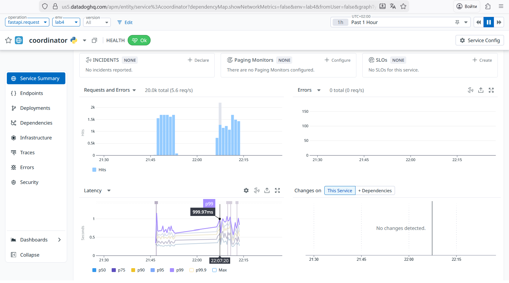
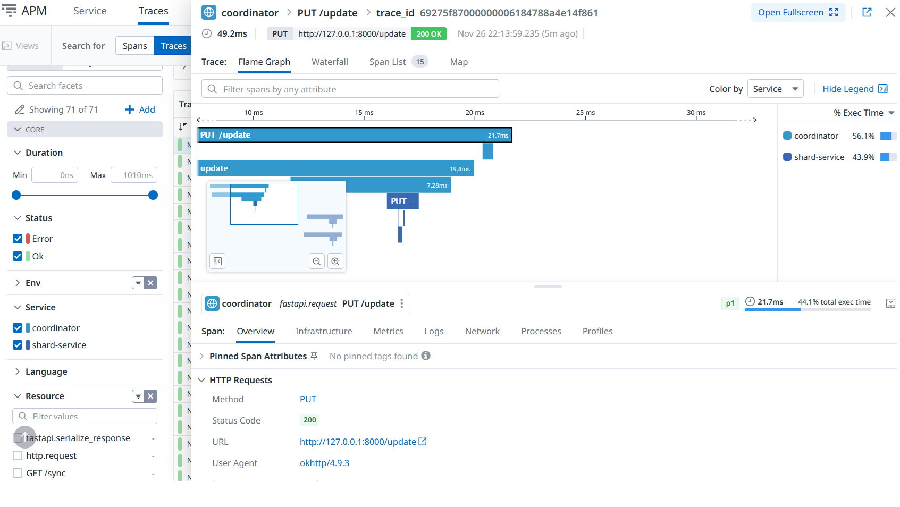
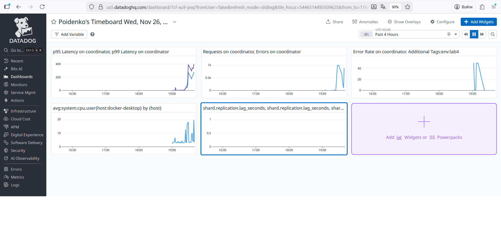
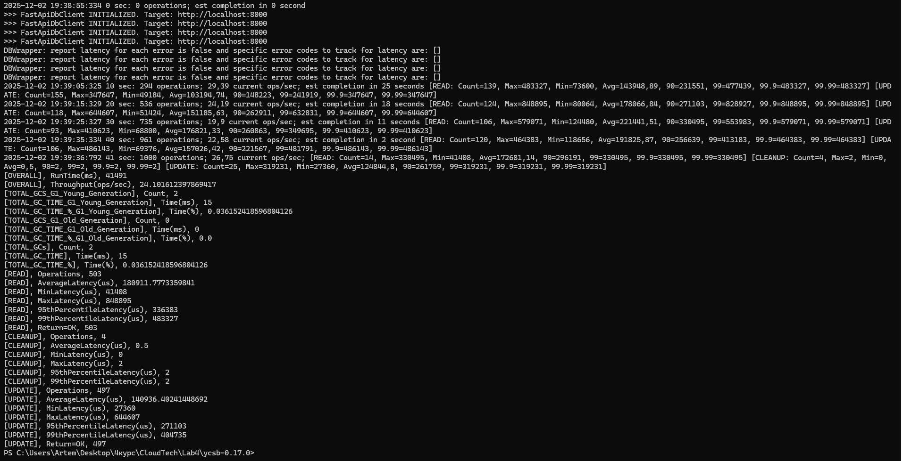
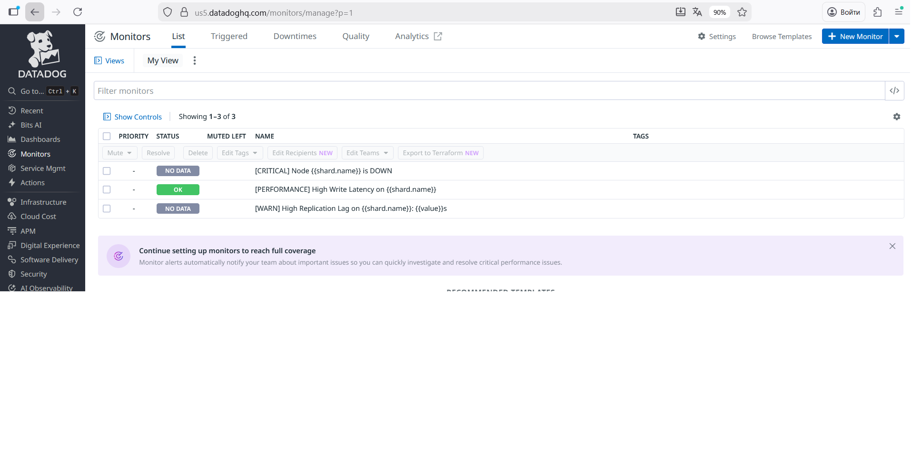
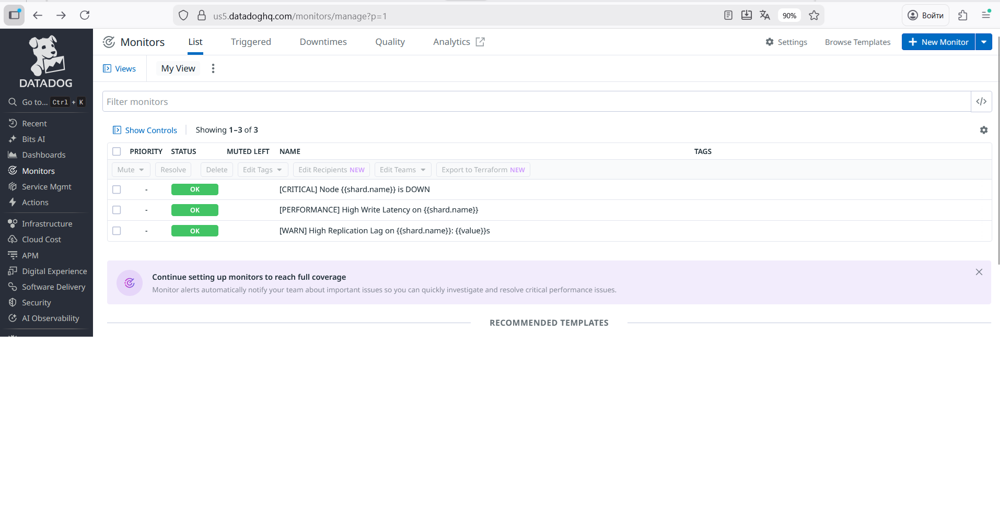
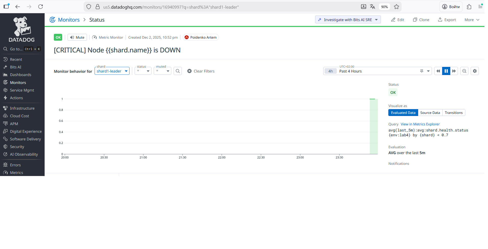

# 1. Monitoring Setup (7)

## a. Set up metrics collection (Prometheus/CloudWatch/Datadog/sentry): latency (p50, p95, p99), throughput, error rate for coordinator and shards. (2 points)
## Free datadog and sentry with your university mail https://education.github.com/pack 

## Для виконання був обраний datadog і проведене тестування навантаження  за допомогою YCSB

## b. Add structured logging with trace IDs to track requests through the system. (1 point)

## Цей скріншот є доказом того, що Distributed Tracing (структуроване логування) працює: 
## Trace ID пов'язує всі операції.
## Видно перехід запиту від одного сервісу (coordinator) до іншого (shard-service) і як між ними розподіляється час.
## Latency виглядає нормально 

## c. Create a dashboard with key metrics: cluster health, replication lag, shard distribution. (2 points)

## Дашбоард

## Навантаження на систему.

## d. Set up alerting for critical events: node down, high latency (p99 > threshold), replication lag > N seconds. (2 points)

## Створено монітори

## Оновлений статус моніторів

## Приклад спрацювання алерту, при вимкненні ноди shard1-leader
