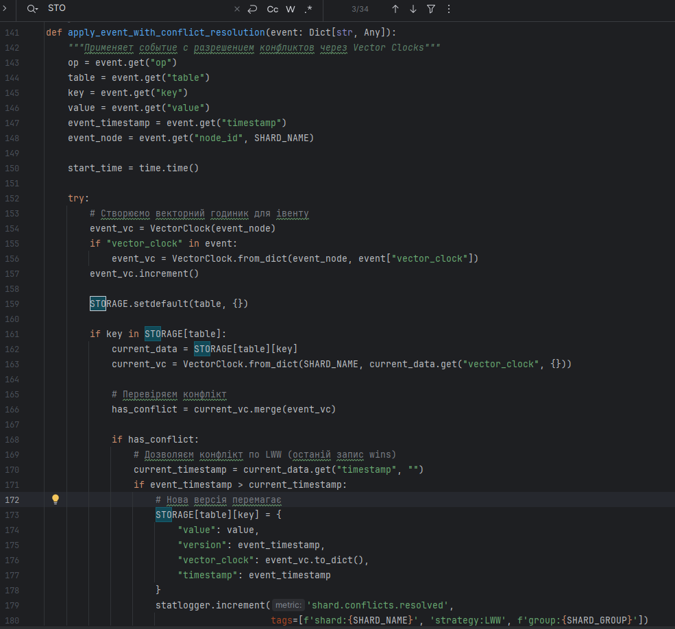
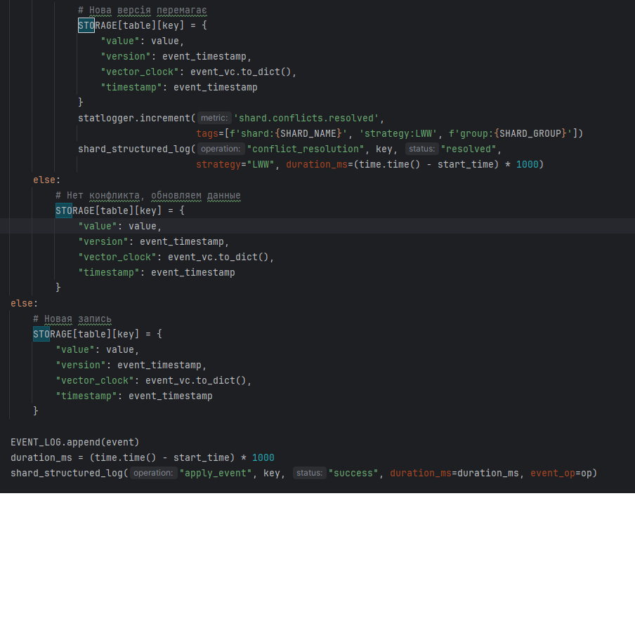
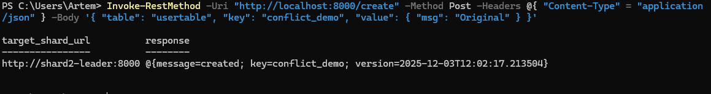
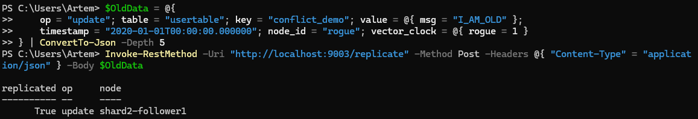
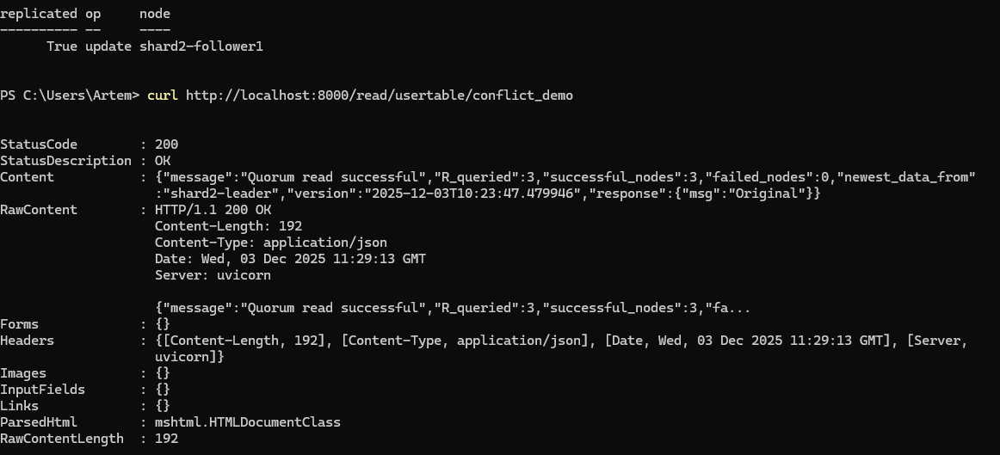
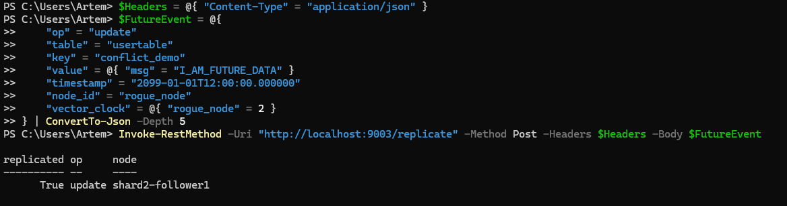
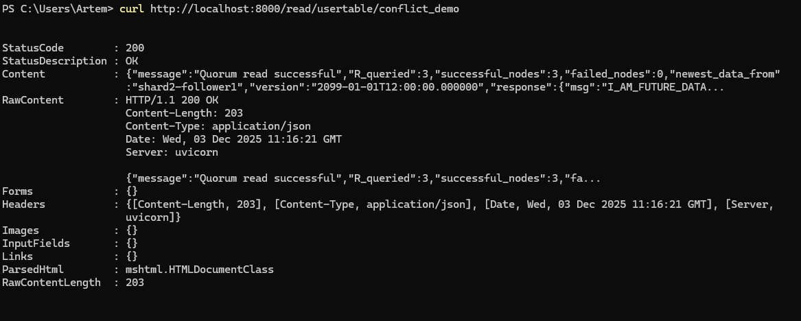
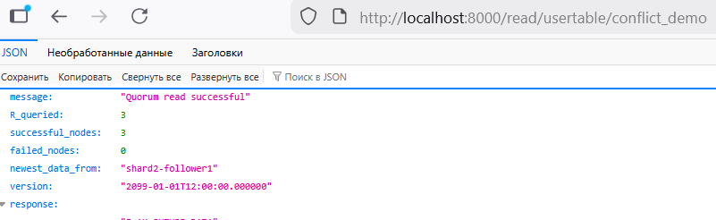
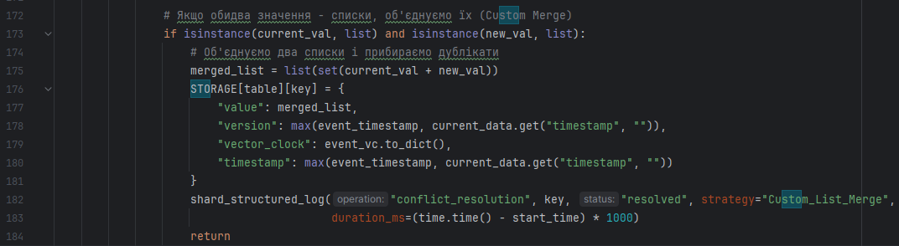
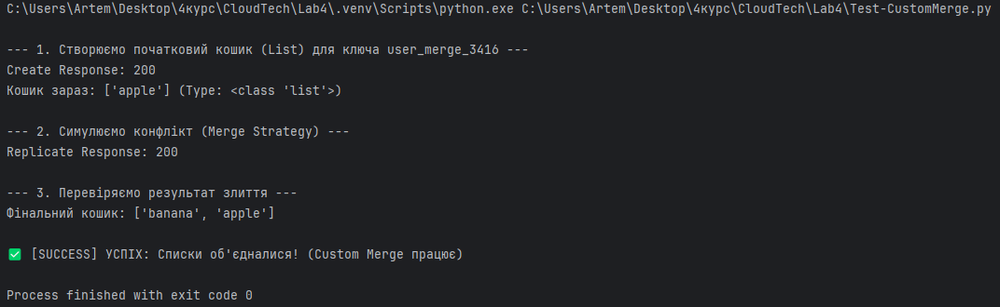

# 1. Conflict Resolution (5)

# a. Implement versioning for records (vector clocks or timestamps). (2 points) 

## Для виконання був обраний datadog і проведене тестування навантаження  за допомогою YCSB

## Реалізація в коді шарду

# b. Implement Last-Write-Wins (LWW) conflict resolution strategy. (2 points)

## Логіка вирішення конфлікту

## Тепер проведемо експеримент: 

## Створюмо еталонний запис через Координатор

## Спробуємо зламати систему старим запитом

## Перевірка змін

## Тепер оновлюємо систему майбутнім запитом

## Перевірка змін

# c. (Optional) Add alternative strategy: custom merge function or client-side conflict resolution. (1 point)

## Реалізація стратегії злиття для списків

## Для демонстрації гнучкості системи було реалізовано спеціальну логіку злиття (Merge) для списків. 
## Замість повної заміни даних (як у LWW), нові елементи додаються до існуючого списку без дублікатів.

