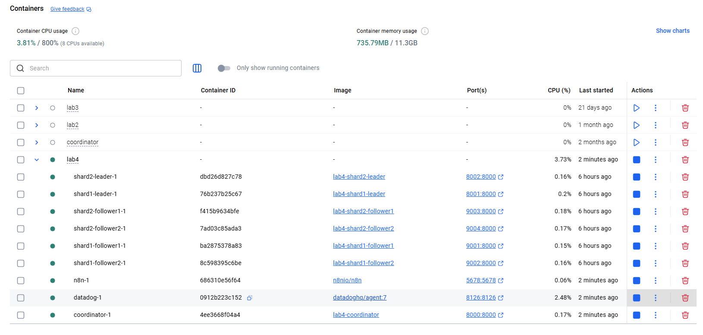
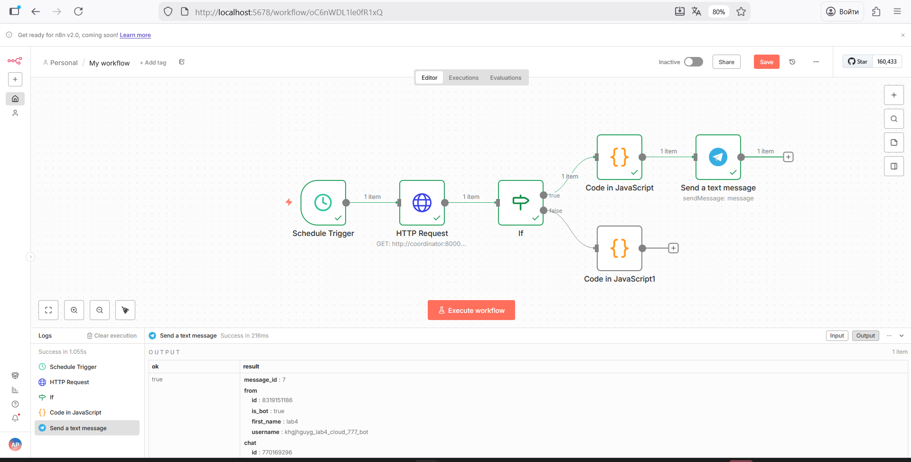
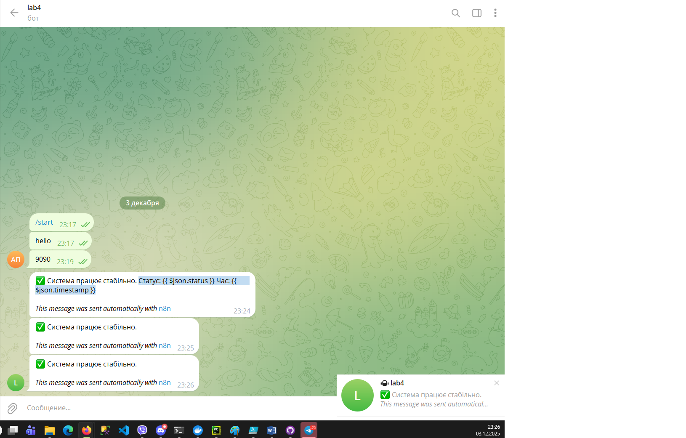
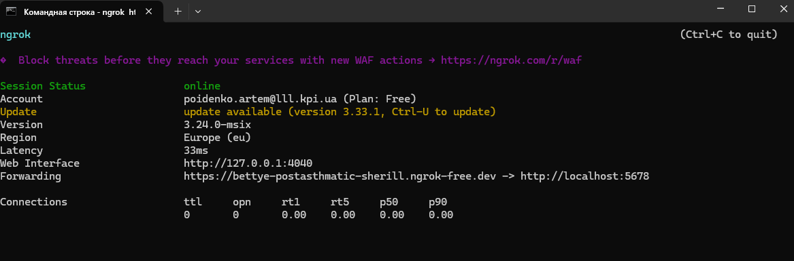
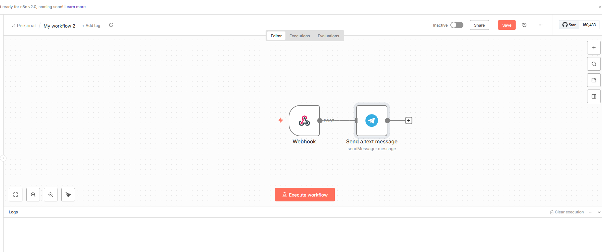

# 3. N8N Agentic Integration - Choose one or more options (max 5 points from this section):

# b. Operational Automation (2 points) Implement automated operational tasks:
## Generate daily health reports with key metrics
## Крок 1. Додаємо N8N у docker-compose.yml

## Додали сервіс n8n

## Налаштовано воркфлов в N8N

## Було налаштовано відправку повідомлення у телеграм
## Реалізація Health Check Workflow
## Було створено workflow, який складається з таких етапів:
## Schedule Trigger: Запускає процес за розкладом (інтервал 1 хвилина для демо).
## HTTP Request: Виконує GET-запит до http://coordinator:8000/health.
## If (Condition): Перевіряє статус healthy.
## Generate Report: Формує JSON-звіт та надсилає його (або зберігає).

# (2 points) Automated incident response. Create n8n workflow that:
# Listens to your alerting system

## Налаштовуємо пересилання пакетів через NGROK

## Workflow для обробки вебхуків та надсилання в телеграм

 

