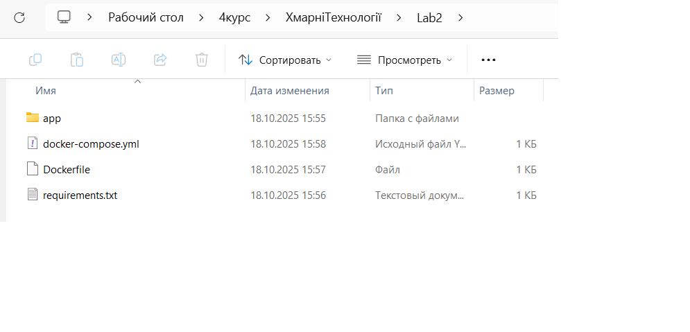
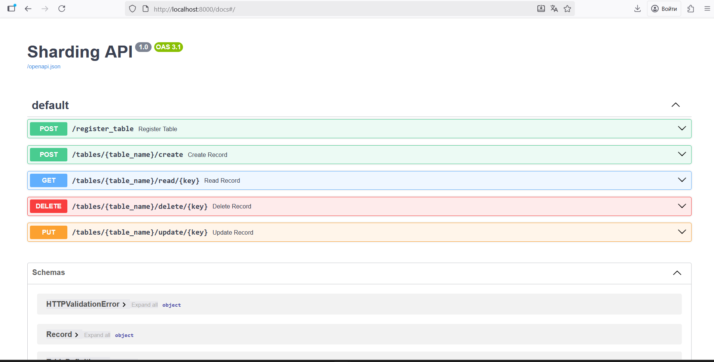
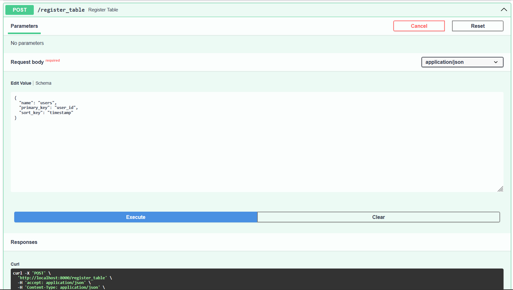
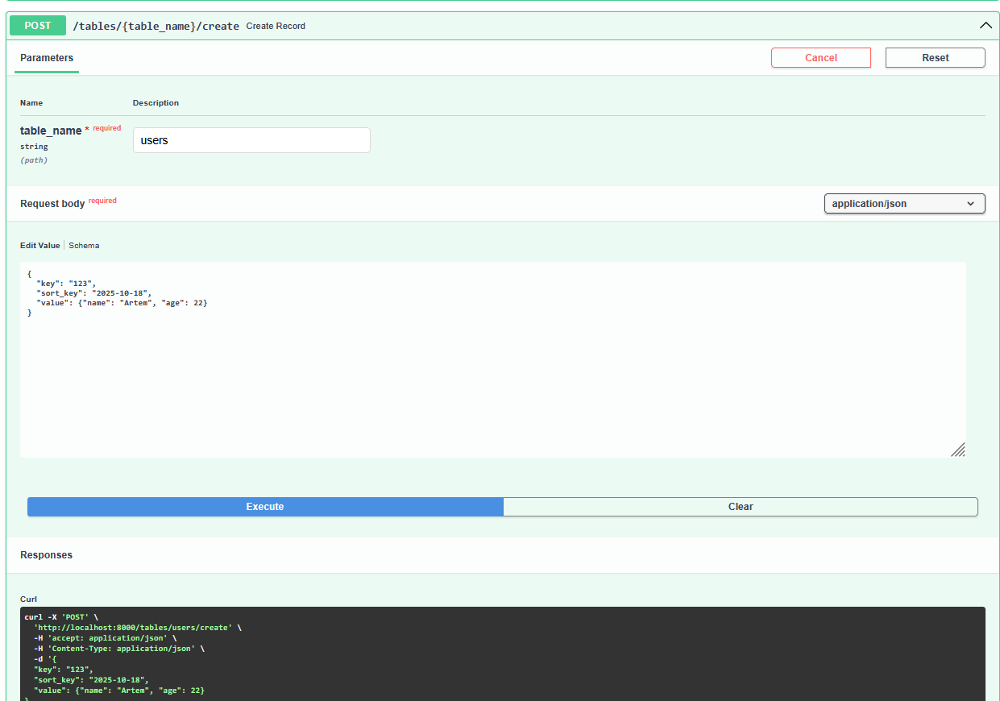
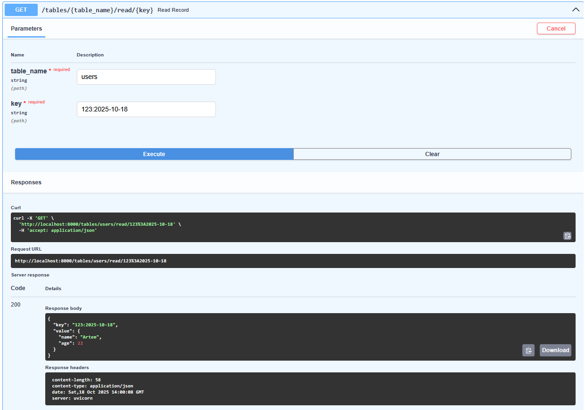
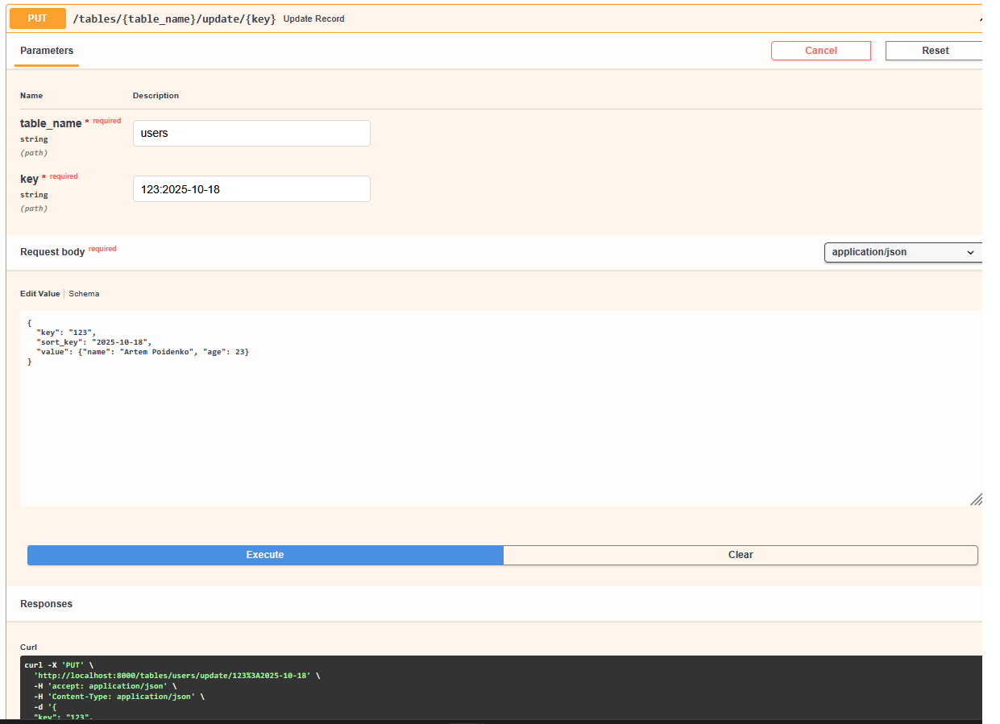
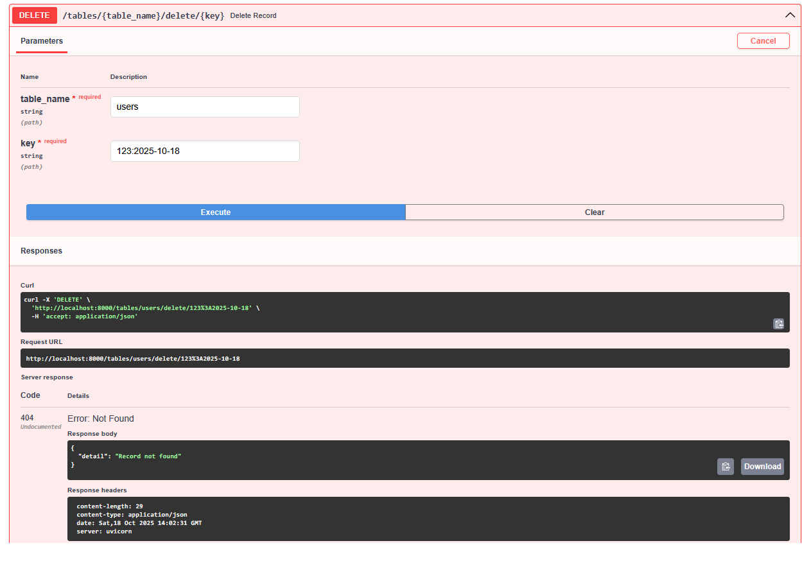

# Create an API specification (OpenAPI REST, graphql, grpc, anything u want) for
#Registering table definition (1 point)
#CRUD over table records (1 point)
#(Optional) Make a compound primary key: Partition key + sort key. (2 points)
# Початкова структура файлів

## Базове API

## Registering table definition (1 point)

## CRUD over table records (1 point)
##(Optional) Make a compound primary key: Partition key + sort key. (2 points)

## GET

## PUT

## DELETE
