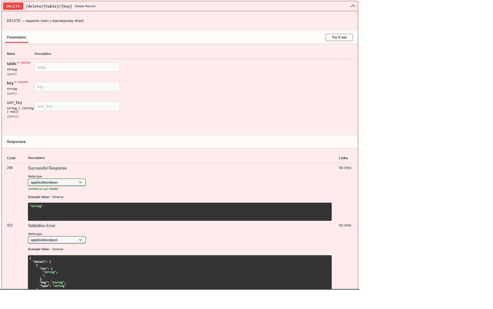

# Implement the “Coordinator” node which will support this API in single-node mode. Required operations (u can add more depending on your idea): (4 points)
# EXISTS - checks if value for key is present
# CREATE - put a key-value pair
# DELETE - remove value for key
# READ

# Coordinator Node - Single Mode

## CREATE метод

## EXISTS метод

## READ метод

## DELETE метод
