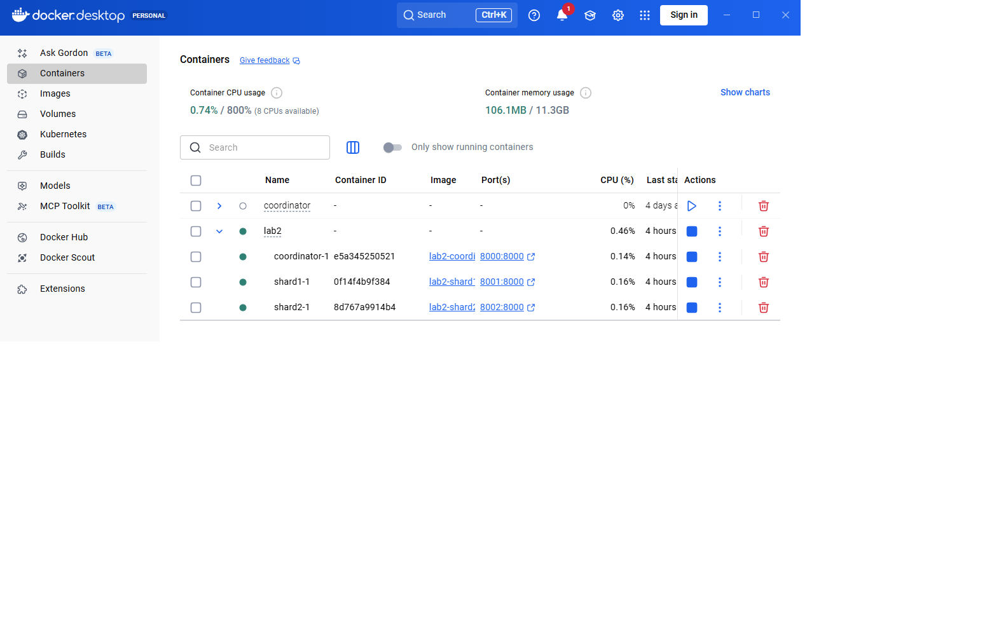
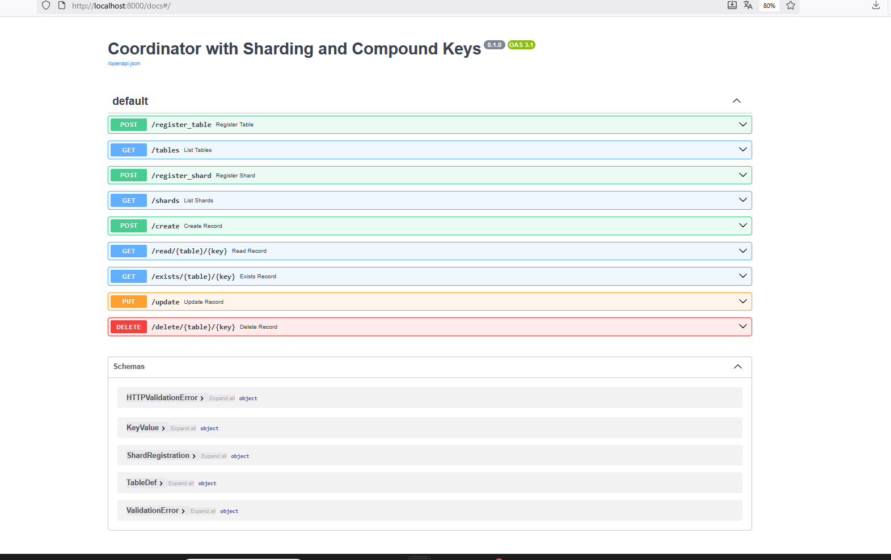
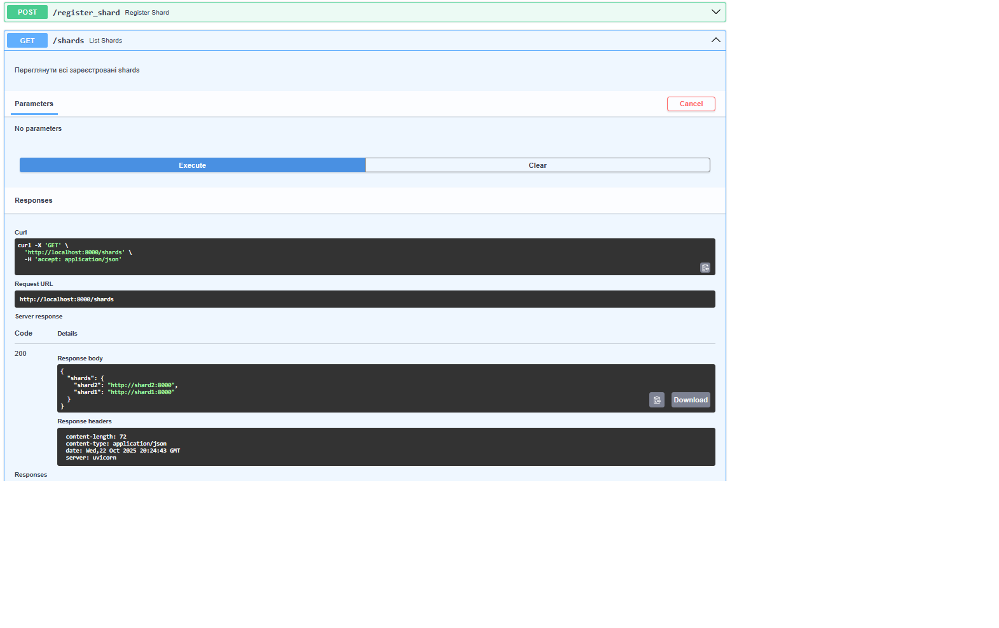
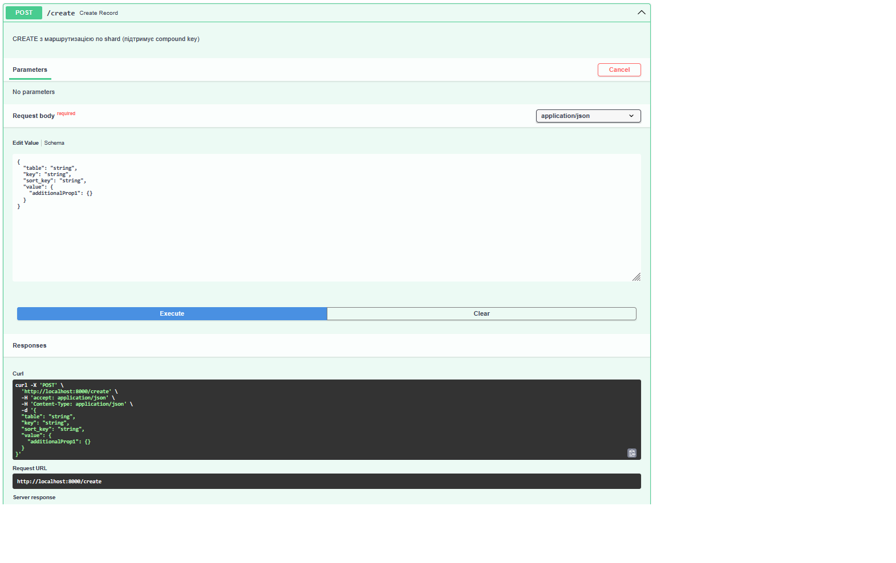
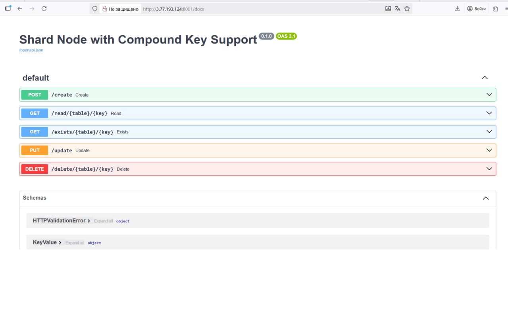

# Now Sharding: 
## Shard writes. Coordinator calculates hash and based on it selects one of
## downstream shards. Shards are registered in the coordinator upon start.
## (API needs to be added). Use consistent hashing or similar algorithms 
## for dynamic updates. (3 points)
## Shard reads (2 points)

# Приклад запуску контейнерів

## API Coordinator With Sharding

## Методи керування шардами 

## Create record

## Shards з доданим методом Update

